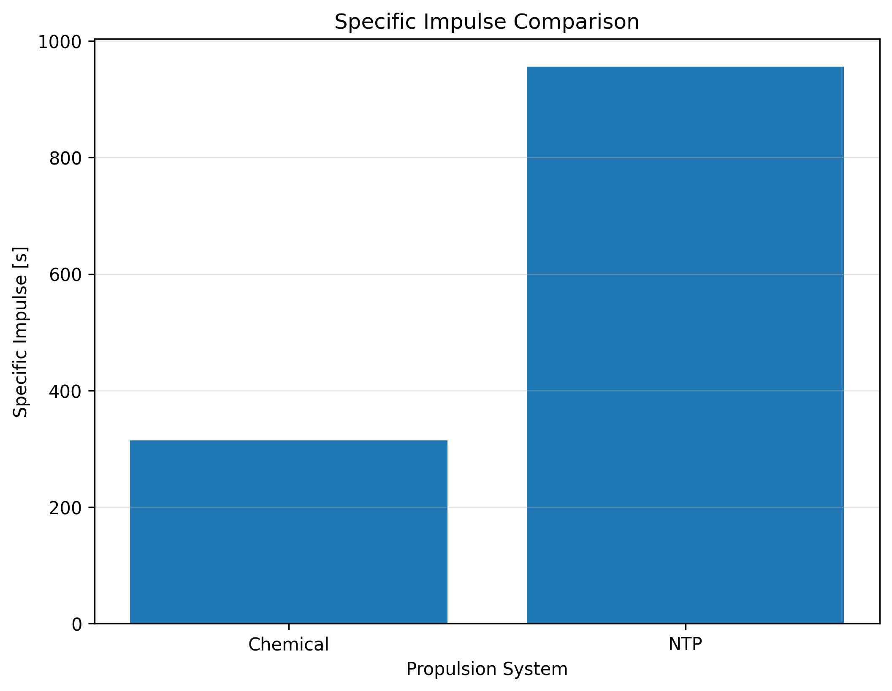
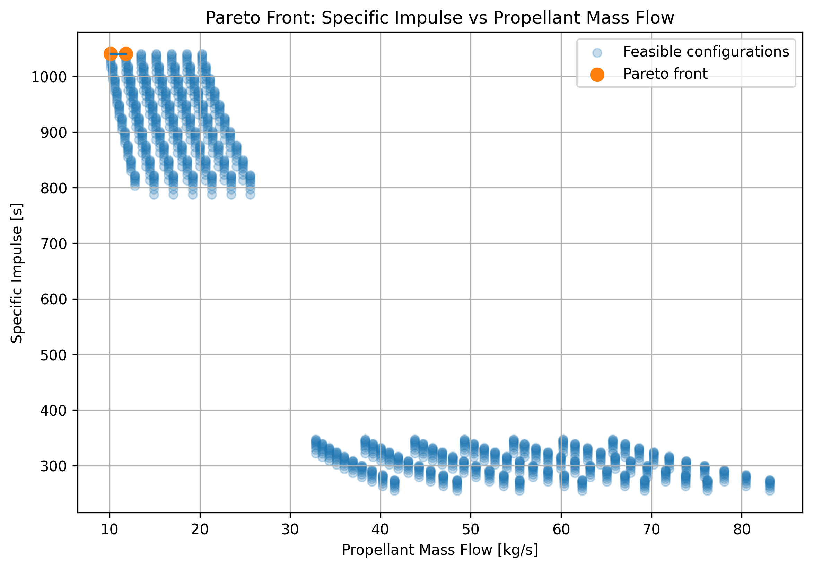

# Rocket Propulsion Performance Analysis
### Chemical vs Nuclear Thermal Propulsion (NTP)

## Project Overview

This project analyzes and compares the performance of a conventional chemical rocket propulsion system with a simplified Nuclear Thermal Propulsion (NTP) model.

The objective is to study how chamber pressure, chamber temperature, nozzle expansion ratio and propellant properties affect key propulsion parameters such as:

- Mass flow rate
- Exit Mach number
- Exit pressure
- Exit temperature
- Exit velocity
- Thrust
- Specific impulse

The project combines engineering calculations, CAD geometry, Python simulations and SQL-based data analysis.

---

## Tools Used

- Microsoft Excel
- AutoCAD Web
- Python
- Pandas
- NumPy
- Matplotlib
- SQLite / SQL

---

## Methodology

### 1. Baseline thermodynamic model

A first propulsion model was developed in Excel.

The following input parameters were defined:

- Chamber pressure
- Chamber temperature
- Throat area
- Exit area
- Expansion ratio
- Specific heat ratio
- Specific gas constant
- Ambient pressure

The main output parameters were then calculated:

- Mass flow rate
- Exit Mach number
- Exit pressure
- Exit temperature
- Exit velocity
- Thrust
- Specific impulse

---

### 2. Chemical vs NTP comparison

Two simplified propulsion systems were analyzed.

#### Chemical propulsion

A representative combustion-gas model was used.

#### Nuclear Thermal Propulsion

A simplified hydrogen-based NTP model was used in which thermal energy is assumed to be transferred to the propellant before expansion through the nozzle.

The results show the influence of low molecular-weight propellant on exhaust velocity and specific impulse.

---

## CAD Nozzle Geometry

A simplified convergent-divergent nozzle was designed in AutoCAD.

The geometry includes:

- Combustion chamber
- Convergent section
- Throat
- Divergent nozzle
- Exit section

The throat and exit dimensions were derived from the areas used in the thermodynamic model.

---

## Python Simulation

The Excel model was converted into a Python simulation.

A reusable propulsion-performance function was developed to calculate:

- Exit Mach number
- Mass flow rate
- Exit pressure
- Exit temperature
- Exit velocity
- Thrust
- Specific impulse

A numerical bisection method was implemented to determine the supersonic exit Mach number corresponding to a given nozzle expansion ratio.

---

## Parametric Analysis

A parametric study was performed by varying:

- Chamber pressure
- Chamber temperature
- Expansion ratio

A total of 2000 configurations were generated:

- 1000 Chemical
- 1000 NTP

The resulting dataset was analyzed using Pandas.

---

## Sensitivity Analysis

Several performance trends were investigated, including:

- Specific impulse vs chamber temperature
- Thrust vs chamber pressure
- Specific impulse vs expansion ratio
- NTP performance maps

These analyses show how propulsion performance changes as the main design parameters vary.

---

## Optimization

A constrained optimization was performed with the requirement:

`Thrust >= 100 kN`

The configurations were then ranked according to specific impulse.

A Pareto analysis was also performed to study the trade-off between:

- Maximum specific impulse
- Minimum propellant mass flow

This approach identifies configurations where improving one objective would worsen the other.

---

## SQL Analysis

The Python simulation dataset was exported to CSV and imported into SQLite.

SQL queries were used to:

- Filter NTP configurations
- Select configurations above a minimum thrust
- Rank configurations by specific impulse
- Calculate average and maximum performance
- Compare Chemical and NTP systems
- Analyze Pareto-optimal configurations

---

## Example Results

For the baseline cases, the simplified models produced approximately:

| Parameter | Chemical | NTP |
|---|---:|---:|
| Mass flow rate | 40.97 kg/s | 12.62 kg/s |
| Exit velocity | 2.92 km/s | 9.09 km/s |
| Thrust | 126.3 kN | 118.3 kN |
| Specific impulse | 314 s | 956 s |

The optimized NTP cases reached specific impulse values above:

`1000 s`

within the assumptions of the simplified model.

### Key Plots




---

## Project Structure

```text
Rocket_Propulsion_Project/
│
├── data/
│   ├── rocket_propulsion_simulations.csv
│   └── pareto_optimal_configurations.csv
│
├── cad/
│   ├── Rocket_Nozzle_Geometry.dwg
│   └── Rocket_Nozzle_Geometry.pdf
│
├── notebooks/
│   └── Rocket_Propulsion_Simulation.ipynb
│
├── sql/
│   └── Rocket_Propulsion_Queries.sql
│
├── results/
│   └── plots/
│
└── README.md
